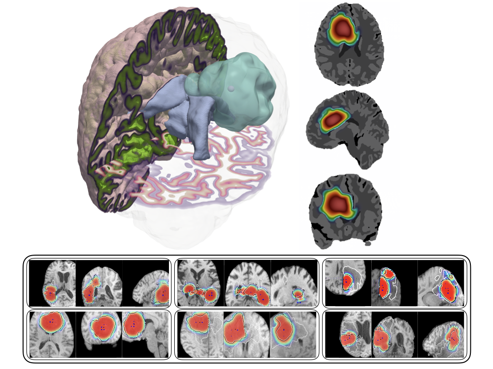

## GLIA
*GL*ioblastoma *I*mage *A*nalysis for calibrating brain tumor growth models is a suite of high-performance algorithms and software to integrate biophysical models of tumor growth with medical imaging data to advance personalized medicine.

GLIA has the following features:

* 3D tumor growth simulation using complex growth models with mass effect and multiple tumor species
* Inversion algorithms for reconstructing the following using a ***single*** mpMRI patient imaging scan:
  * Tumor initiation location(s) or TILs 
  * Tumor dynamics parameters representing cancer proliferation and infiltration
  * Tumor-induced biomechanical effects or mass effect 
* Novel numerical schemes with parallelized execution that exploits mulitcore CPU and GPU architectures for fast solution times on medical imaging data resolutions (256x256x256)

## Installation
See doc/install.md for guide to install

## Authors
Shashank Subramanian, Klaudius Scheufele, George Biros

*Other contributors*: Naveen Himthani, Amir Gholami, Miriam Mehl, Andreas Mang

## References
If you use GLIA or presented algorithms in your research, please cite:
* Forward tumor growth models: S. Subramanian, A. Gholami & G. Biros. **Simulation of glioblastoma growth using a 3D multispecies tumor model with mass effect**. Journal of Mathematical Biology 2019 [[arxiv](https://arxiv.org/abs/1810.05370), [jomb](https://link.springer.com/article/10.1007/s00285-019-01383-y)].

* TIL inversion algorithms: S. Subramanian, K. Scheufele, M. Mehl & G. Biros. **Where did the tumor start? An inverse solver with sparse localization for tumor growth models**. Inverse Problems 2020 [[arxiv](https://arxiv.org/abs/1907.06564), [ip](https://iopscience.iop.org/article/10.1088/1361-6420/ab649c/meta)]; K. Scheufele, S. Subramanian & G Biros. **Fully-automatic calibration of tumor-growth models using a single mpMRI scan**. IEEE Transactions in Medical Imaging 2020 [[arxiv](https://arxiv.org/abs/2001.09173), [tmi](https://ieeexplore.ieee.org/abstract/document/9197710)].

* Mass effect inversion algorithms: S. Subramanian, K. Scheufele, N. Himthani & G. Biros. **Multiatlas calibration of brain tumor growth models with mass effect**. MICCAI 2020 [[arxiv](https://arxiv.org/abs/2006.09932), [miccai](https://link.springer.com/chapter/10.1007/978-3-030-59713-9_53)].

## License
GLIA is distributed under GNU GENERAL PUBLIC LICENSE Version 2.
Please see LICENSE file.

## old (remove)

## Installation

- Install PETSC (version 3.7 or later, see https://dealii.org/developer/external-libs/petsc.html for installation guide)
- Install PNETCDF (see http://accfft.org/articles/install/ for installation guide)
- Install FFTW3 (version 3.3.4 or later, see http://accfft.org/articles/install/ for installation guide)
- Install AccFFT (see http://accfft.org/articles/install/ for installation guide)
- Set the following paths:
  - ACCFFT_DIR, ACCFFT_LIB, ACCFFT_INC 
  - PETSC_DIR, PETSC_LIB, PETSC_INC 
  - PNETCDF_DIR, PNETCDF_LIB, PNETCDF_INC 
  - FFTW_DIR, FFTW_LIB, FFTW_INC 
- Use scons to create the executables or the compile script. scons --help to see list of options available

## Documentation

Scons will create binaries in build/last. Use /scripts/TumorParams.py to set input parameters for the code.
Use /scripts/submit.py to submit jobs 
